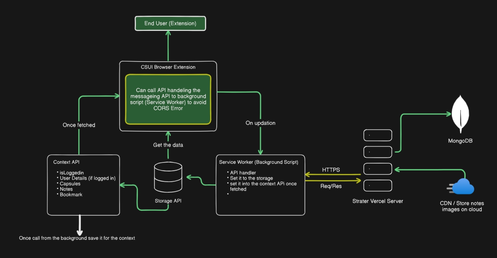

# Strater AI

Strater AI is a Plasmo browser extension built for YouTube learners. It helps you stay focused while learning from videos by offering tools to take structured notes, organize them into folders, and convert them into flashcards.

---

## ⚙️ Architecture Overview

To help contributors and developers understand the data flow and architecture behind the Strater extension, here's a visual representation:



### Key Concepts:

- **CSUI Browser Extension** communicates with the **Background Script (Service Worker)** to avoid CORS issues by delegating API calls.
- The **Service Worker** fetches data from the **Strater Vercel Server** (connected to **MongoDB** and a **CDN**) and stores it using the **Storage API**.
- The **Context API** picks this data up and shares it across all components (notes, folders, bookmarks, etc.).
- Data flow is unidirectional—from background fetch to storage, then shared across the extension UI.

---

## 📁 Folder Structure

- **`components`** – Contains UI components like chatbot, video player, notes, folders, etc.
- **`contents`** – All content scripts (CSUIs) that get injected into the YouTube page.
- **`contextAPI`** – Global context management for user state, notes, bookmarks, etc.
- **`data-text`** – Static CSS and text assets.
- **`utils`** – Reusable utility functions (e.g., parsing, random string generation).

---

## 🧠 How to Contribute

1. Clone the repo.
2. Run `pnpm install` to install dependencies.
3. Modify the code as needed.
4. Run `pnpm build` to build the extension.
5. Load it in Chrome:
   - Go to `chrome://extensions/`
   - Enable Developer Mode
   - Click "Load unpacked" and select the `build` folder
6. Test your changes.
7. Submit a pull request.

---

## 🛠️ Build the Extension

To create a production-ready bundle:

```bash
pnpm build
```
